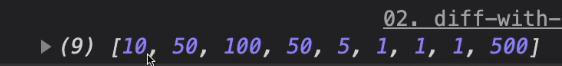

# 與傳統函示不同處

## 沒有 `arguments` 參數

使用 `spread` (其餘參數) 將參數帶入

```js
const nums = (...arg) => {
  console.log(arg);
};
nums[(10, 50, 100, 50, 5, 1, 1, 1, 500)];
```



## `This` 綁定的差異

傳統函式在 `this` 的綁定，會指向呼叫的物件本身，而箭頭函式沒有自己的 `this`

```js
const myName = '全域';
const person = {
  myName: '小明',
  callName: function() {
    console.log('1', this.myName);
    // 可暫時視 setTimeout 中的 this 跟 callName 為同一層
    // 所以 this 會指向 person 的作用域
    setTimeout(() => {
      // 會找到 [小明]
      console.log('1', this.myName);
      console.log('3', this);
    }, 10);
  },
  // 暫時視 callName 中的 this 跟 person 為同一層
  // 所以 this 會指向 Windows 的作用域
  callName: () => {
    // 會找到 [全域]
    console.log('1', this.myName);
  },
};
person.callName();
```

## DOM 的 `This` 綁定

```js
const elem = document.querySelector('p');
elem.addEventListener('click', function() {
  // this 指向 p 標籤
  console.log(this);
});
elem.addEventListener('click', () => {
  // this 指向 Windows
  console.log(this);
});
```

## 建構函式

- 範例一

```js
const Fn = function(a) {
  this.name = a;
};

const ArrowFn = a => {
  this.name = a;
};

console.log(Fn.prototype, ArrowFn.prototype);
```


所以，箭頭函式 **沒有** 辦法作為建構函式使用

- 範例二

```js
const Fn = function(a) {
  this.name = a;
};
Fn.prototype.protoFn = () => {
  return this.name;
};
const newObj = new Fn('函式');
console.log(newObj.protoFn());
```

結果會為空值，因為可視 `protoFn` 的 `this` 和 `Fn` 為同一層，`this` 會指向 `Windows`
