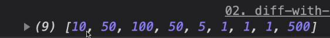

# 箭頭函式

## 沒有 `arguments` 參數

使用 `spread` (其餘參數) 將參數帶入。

```js
const nums = (...arg) => {
  console.log(arg);
};
nums[(10, 50, 100, 50, 5, 1, 1, 1, 500)];
```



## `this` 綁定的差異

傳統函式在 `this` 的綁定，會指向呼叫的物件本身，而箭頭函式沒有自己的 `this`。

箭頭函式的 `this` 會等於所在函式作用域中的 `this`，**如果箭頭函式沒有被任何函式包住，它的作用域就會是全域的作用域**。

```js
const myName = '全域';
const person = {
  myName: '小明',
  callName: function() {
    console.log('1', this.myName); // 小明

    setTimeout(() => {
      // 會找到 "小明"，這時箭頭函式的 this 指向 callName 函式的作用域
      console.log('1', this.myName);
      console.log('3', this); // {myName: "小明", callName: ƒ}
    }, 10);
  },
  callName: () => {
    // 會找到 [全域]，因箭頭函式的外層沒有函式，所以指向到 windows 的作用域
    console.log('1', this.myName);
  },
};
person.callName();
```

### 使用強制指定

箭頭函式是無法使用 `bind()`、`call()`、`apply()` 來指定 `this`。

```js
const fn = () => {
  console.log(this);
};

fn.bind()(); // window
fn.call({}); // window
fn.apply({}); // window
```

## 巢狀的 `this` 作用域

```js
const Ming = {
  myName: '小明',
  family: {
    myName: '小明家',
    fn: () => {
      console.log(this.myName); // 全域
    },
  },
};
Ming.family.fn();
```

因為箭頭函式的外層沒有函式，所以直接對應全域。

## 立即函式的 `this` 作用域

```js
(function() {
  var myName = '立即函式作用域';
  var Ming = {
    myName: '小明',
    fn: () => {
      console.log(this.myName); // 全域
    },
  };
  Ming.fn();
})();
```

因立即函式屬於 `simple call`，`this` 指向全域。

```js
(function() {
  console.log(this === window); // 立即函式的 this 與全域相同
})();
```

## DOM 的 `this` 綁定

```js
const elem = document.querySelector('p');
elem.addEventListener('click', function() {
  // this 指向 p 標籤
  console.log(this);
});
elem.addEventListener('click', () => {
  // this 指向 Windows
  console.log(this);
});
```

## 建構函式

- 範例一

```js
const Fn = function(a) {
  this.name = a;
};

const ArrowFn = (a) => {
  this.name = a;
};

console.log(Fn.prototype, ArrowFn.prototype);
```


所以，箭頭函式 **沒有** 辦法作為建構函式使用。

- 範例二

```js
const Fn = function(a) {
  this.name = a;
};
Fn.prototype.protoFn = () => {
  return this.name;
};
const newObj = new Fn('函式');
console.log(newObj.protoFn());
```

結果會為空值，因為可視 `protoFn` 的 `this` 和 `Fn` 為同一層，`this` 會指向 `Windows`。

## 使用提醒

- 物件內的屬性方法避免使用箭頭函式定義
- 箭頭函式外層的函式越單純越好，避免過度巢狀
- 當使用箭頭函式，請先確認外層的 `this` 指向

## 參考

[箭頭函式常見陷阱題](https://ithelp.ithome.com.tw/articles/10246165)

[this 與物件的關係](https://wcc723.github.io/javascript/2019/03/18/JS-THIS/)
