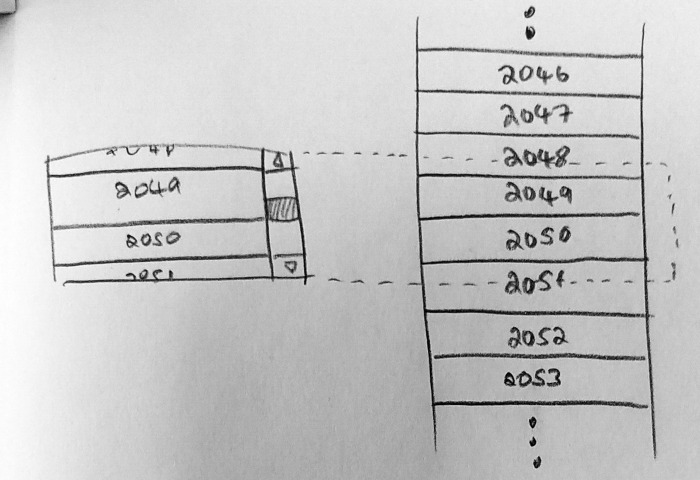

# Virtualized List



大多數虛擬化列表組件的工作方式是，不傳遞要呈現的元素列表，而是僅向列表提供我們要呈現的元素數量，每個元素的大小以及呈現單個項目的回調。

我們需要更改的第一件事是列表中元素的佈局方式。通常，我們會彼此相鄰創建許多 `div`，然後讓佈局引擎將它們堆疊起來，但是現在將跳過大多數元素，我們將 **絕對定位每個元素**，並強制將內部容器設置為正確的高度，以便滾動條仍將正確呈現。

我們可以將每個項目包裝在新的 `div` 中以賦予其 `position` 和 `top` 的值。但是，大多數虛擬化列表的套件，是將某些樣式傳遞給項目渲染，接著使用者需要將其應用於自己的元素。這樣會稍微複雜一些，但效率更高一點，因此我們可以來手動造輪子。

現在，有了需要顯示的項目列表，有每個項目的索引，知道這些項目有多高。我們需要計算應該可見的項目的索引。因此，要注意有下方：

- `innerHeight` - 列表本身的總高度。它是項目高度乘以項目數
- `scrollableAreaHeight` - 可滾動區域的高度，一個可以滾動的完整列表。該高度將取決於周圍的元素
- `scrollTop` - 測量內部容器的滾動距離。它是內部容器頂部與其可見部分之間的距離

我們將元素位置轉換為元素索引，並 **渲染這兩個索引之間** 的所有元素：

```js
{
  data() {
    return {
      // 全部的項目數量
      numItems: 100,
      // 項目的高度
      itemHeight: 40,
      // 可滾動的區域高度
      scrollableAreaHeight: 400,
      // 滾動條距離最上方的距離
      scrollTop: 0
    };
  },
  methods: {
    /**
     * 滾動事件
     * @param {object} e - scroll event
     */
    scrollHandler(e) {
      this.scrollTop = e.currentTarget.scrollTop;
    }
  },
  render() {
    const innerHeight = this.numItems * this.itemHeight;
    const startIndex = Math.floor(this.scrollTop / this.itemHeight);
    const endIndex = Math.min(
      this.numItems, // don't render past the end of the list
      Math.floor((this.scrollTop + this.scrollableAreaHeight) / this.itemHeight)
    );

    return(
      <div
        class="scroll"
        style={{height: `${this.scrollableAreaHeight}px`}}
        onScroll={this.scrollHandler}>
        <ul class="inner" style={{height: `${innerHeight}px`}}>
          {
            Array.from({length: (endIndex - startIndex )}, (item, index) => (
              <ItemComponent
                index={index + startIndex + 1}
                style={{
                  top: `${(index + startIndex) * this.itemHeight}px`,
                  height: `${this.itemHeight}px`,
                  lineHeight: `${this.itemHeight}px`}}>
              </ItemComponent>
            ))
          }
        </ul>
      </div>
    )
  }
}
```

下方的範例可以透過 Dev tool 觀察，每次渲染時只顯示 10 筆資料。

<TryBox>
  <es6-virtualized-list-VirtualizedList />
</TryBox>

## 參考

[Building a virtualized list from scratch](https://medium.com/ingeniouslysimple/building-a-virtualized-list-from-scratch-9225e8bec120)
