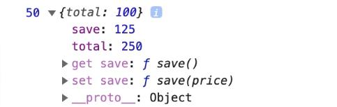

# Getter 與 Setter

::: tip 說明
賦值運算不使用函式
:::

## 方法一

```js
const wallet = {
  total: 100,
  get save() {
    return this.total / 2;
  },
  set save(price) {
    return (this.total += price / 2);
  },
};

console.log(wallet.save, wallet);
// 使用等號賦值，而非函式
wallet.save = 300;
```

預設 `save` 屬性為 `(...)`，當點開後，才會針對目前的 `total` 做 `getter` 取值


## 方法二

```js
const wallet = {
  total: 100;
}
// 預設的 save 屬性，configurable 和 enumerable 皆為 false
Object.defineProperty(wallet, 'save', {
  // 可以選擇是否加回來
  // configurable: true,
  // enumerable: true,
  get() {
    return this.total / 2;
  },
  set(price) {
    return this.total += price / 2
  }
})

wallet.save = 300;
```


## 實例

```js
const a = [1, 2, 3];
// 直接操作陣列原型
Object.defineProperty(Array.prototype, 'latest', {
  get() {
    return this[this.length - 1];
  },
});

a.latest;
```
