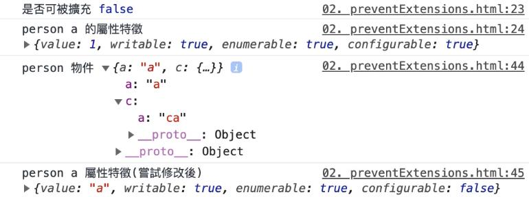
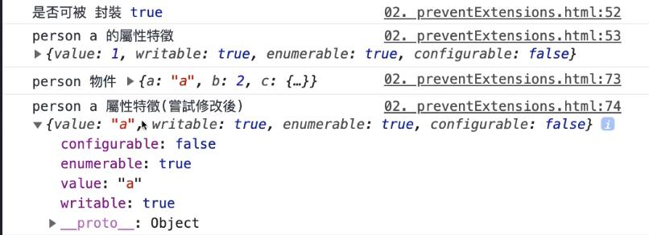
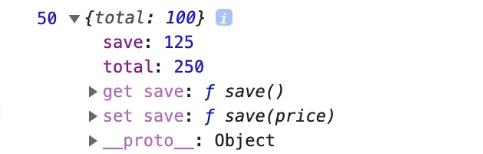

# 物件

## 擴充的修改與調整

::: warning 注意
下面三種方法是針對物件本身做操作，但因物件有參考特性，無法對 **巢狀** 的屬性有所動作
:::

## preventExtensions

- 中文語意：防止擴充

```js
Object.preventExtensions(person);
// 驗證是否可被擴充
console.log('是否可被擴充', Object.isExtensible(person));
console.log(
  'person a 的屬性特徵',
  Object.getOwnPropertyDescriptor(person, 'a')
);

// 調整屬性
person.a = 'a';
// 新增屬性
person.d = 'd';
// 巢狀屬性調整
person.c.a = 'ca';
// 調整特徵
Object.defineProperty(person, 'a', {
  configurable: false,
});
// 刪除
delete person.b;
```



## seal

- 中文語意：封裝
- 物件屬性無法新增刪除，也無法重新配置特徵，但可以調整目前屬性值
- 預設物件會被加上 `preventExtensions`

```js
Object.seal(person);
// 驗證是否可被擴充
console.log('是否可被擴充', Object.isExtensible(person));
// 驗證是否被封裝
console.log('是否被封裝', Object.isSeal(person));
console.log(
  'person a 的屬性特徵',
  Object.getOwnPropertyDescriptor(person, 'a')
);

// 調整屬性
person.a = 'a';
// 新增屬性
person.d = 'd';
// 巢狀屬性調整
person.c.a = 'ca';
// 調整特徵
Object.defineProperty(person, 'a', {
  writable: false,
});
// 刪除
delete person.b;
```



## freeze

- 中文語意：凍結
- 物件會加上 `seal`，並且無法調整值

```js
Object.freeze(person);
// 驗證是否可被擴充
console.log('是否可被擴充', Object.isExtensible(person));
// 驗證是否被封裝
console.log('是否被封裝', Object.isSeal(person));
// 驗證是否被凍結
console.log('是否被凍結', Object.isFrozen(person));
console.log(
  'person a 的屬性特徵',
  Object.getOwnPropertyDescriptor(person, 'a')
);

// 調整屬性
person.a = 'a';
// 新增屬性
person.d = 'd';
// 巢狀屬性調整
person.c.a = 'ca';
// 調整特徵
Object.defineProperty(person, 'a', {
  configurable: false,
});
// 刪除
delete person.b;
```


## Getter 與 Setter

::: tip 說明
賦值運算不使用函式
:::

### 方法一

```js
const wallet = {
  total: 100,
  get save() {
    return this.total / 2;
  },
  set save(price) {
    return (this.total += price / 2);
  },
};

console.log(wallet.save, wallet);
// 使用等號賦值，而非函式
wallet.save = 300;
```

預設 `save` 屬性為 `(...)`，當點開後，才會針對目前的 `total` 做 `getter` 取值


### 方法二

```js
const wallet = {
  total: 100;
}
// 預設的 save 屬性，configurable 和 enumerable 皆為 false
Object.defineProperty(wallet, 'save', {
  // 可以選擇是否加回來
  // configurable: true,
  // enumerable: true,
  get() {
    return this.total / 2;
  },
  set(price) {
    return this.total += price / 2
  }
})

wallet.save = 300;
```


### 實例

```js
const a = [1, 2, 3];
// 直接操作陣列原型
Object.defineProperty(Array.prototype, 'latest', {
  get() {
    return this[this.length - 1];
  },
});

a.latest;
```
