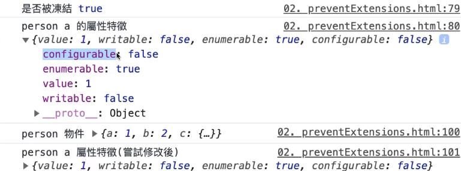

# 物件、陣列與型別判斷

## 物件的擴充修改與調整

::: warning 注意
下面三種方法是針對物件本身做操作，但因物件有參考特性，無法對 **巢狀** 的屬性有所動作
:::

## preventExtensions

- 中文語意：防止擴充

```js
Object.preventExtensions(person);
// 驗證是否可被擴充
console.log('是否可被擴充', Object.isExtensible(person));
console.log(
  'person a 的屬性特徵',
  Object.getOwnPropertyDescriptor(person, 'a')
);

// 調整屬性
person.a = 'a';
// 新增屬性
person.d = 'd';
// 巢狀屬性調整
person.c.a = 'ca';
// 調整特徵
Object.defineProperty(person, 'a', {
  configurable: false,
});
// 刪除
delete person.b;
```


## seal

- 中文語意：封裝
- 物件屬性無法新增刪除，也無法重新配置特徵，但可以調整目前屬性值
- 預設物件會被加上 `preventExtensions`

```js
Object.seal(person);
// 驗證是否可被擴充
console.log('是否可被擴充', Object.isExtensible(person));
// 驗證是否被封裝
console.log('是否被封裝', Object.isSeal(person));
console.log(
  'person a 的屬性特徵',
  Object.getOwnPropertyDescriptor(person, 'a')
);

// 調整屬性
person.a = 'a';
// 新增屬性
person.d = 'd';
// 巢狀屬性調整
person.c.a = 'ca';
// 調整特徵
Object.defineProperty(person, 'a', {
  writable: false,
});
// 刪除
delete person.b;
```


## freeze

- 中文語意：凍結
- 物件會加上 `seal`，並且無法調整值

```js
Object.freeze(person);
// 驗證是否可被擴充
console.log('是否可被擴充', Object.isExtensible(person));
// 驗證是否被封裝
console.log('是否被封裝', Object.isSeal(person));
// 驗證是否被凍結
console.log('是否被凍結', Object.isFrozen(person));
console.log(
  'person a 的屬性特徵',
  Object.getOwnPropertyDescriptor(person, 'a')
);

// 調整屬性
person.a = 'a';
// 新增屬性
person.d = 'd';
// 巢狀屬性調整
person.c.a = 'ca';
// 調整特徵
Object.defineProperty(person, 'a', {
  configurable: false,
});
// 刪除
delete person.b;
```



## Getter 與 Setter

::: tip 說明
賦值運算不使用函式
:::

### 方法一

```js
const wallet = {
  total: 100,
  get save() {
    return this.total / 2;
  },
  set save(price) {
    return (this.total += price / 2);
  },
};

console.log(wallet.save, wallet);
// 使用等號賦值，而非函式
wallet.save = 300;
```

預設 `save` 屬性為 `(...)`，當點開後，才會針對目前的 `total` 做 `getter` 取值


### 方法二

```js
const wallet = {
  total: 100;
}
// 預設的 save 屬性，configurable 和 enumerable 皆為 false
Object.defineProperty(wallet, 'save', {
  // 可以選擇是否加回來
  // configurable: true,
  // enumerable: true,
  get() {
    return this.total / 2;
  },
  set(price) {
    return this.total += price / 2
  }
})

wallet.save = 300;
```


### 實例

```js
const a = [1, 2, 3];
// 直接操作陣列原型
Object.defineProperty(Array.prototype, 'latest', {
  get() {
    return this[this.length - 1];
  },
});

a.latest;
```

## 陣列

陣列的長度可以由 `array.length` 來取得，而 `length` 屬性的值是 **可以被覆寫** 的：

```js
const animals = ['cat', 'dog', 'bird'];

animals.length = 1;
console.log(animals); // ['cat']

animals.length = 3;
console.log(animals); // ['cat', undefined, undefined]
```

上面的例子中，陣列 `animals` 原本的長度為 3，後來透過 `animals.length = 1`; 設定成 1 之後，後面的元素就被移除了。
即使之後再度修改成 `animals.length = 3`;，後面的兩個元素也只會被 `undefined` 所填補。

### 如何判斷是否為陣列

可以使用 `isArray()` 方法：

```js
Array.isArray([]); // true
Array.isArray([1]); // true
Array.isArray(new Array()); // true
```

## 型別判斷

若要在 JavaScript 中檢查變數型別，正確來說應該是 **值的型別，變數沒有型別，值才有**，可以透過 `typeof` 運算子來處理。

要注意的是，透過 `typeof` 運算子回傳的東西都是 **字串**。

### 為什麼函式的型別是 `function` 而不是 `object`？

當我們透過 `typeof` 去檢查一個「函式 (function) 」的時候，雖然會得到 `"function"` 的結果，誤以為 `function` 也是 JavaScript 定義的一種型別，但實際上它仍屬於 `Object` 的一種，可以把它想像成是一種可以被呼叫 (be invoked) 的特殊物件。

> MDN 對 `function` 的定義：
>
> Every JavaScript function is actually a `Function` object.
>
> This can be seen with the code `(function(){}).constructor === Function`, which returns true.

## Pass by sharing

當函式的參數被 **整個** 重新賦值的時候，外部變數的內容是不會被影響的。

```js
const coin = { value: 10 };

const changeValue = (coin) => {
  return (coin = { value: 123 });
};

changeValue(coin); // {value: 123}
console.log(coin); // {value: 10}
```

但如果是 **屬性** 被重新賦值，則會發生改變：

```js
const changeValue = (coin) => {
  return (coin.value = 123);
};

changeValue(coin); // 123
console.log(coin); // {value: 123}
```
