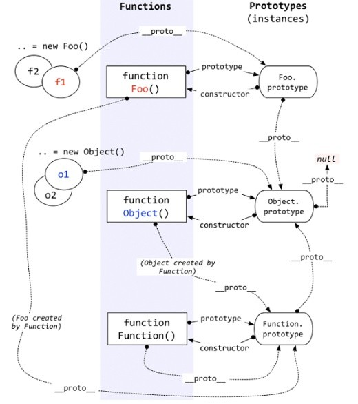

# 物件的原型和原型鏈

JavaScript 是物件導向的程式語言，因為沒有 Class，所以它的繼承方式是透過 **原型 (prototype)** 來進行實做。

原型的繼承概念是可以讓 **本來沒有某個屬性的物件去存取其他物件的屬性**。

:::tip 提醒

物件原型是物件的內部屬性，而且無法直接存取，通常會直接被標示為 `[[prototype]]`。

:::

以參考文章的洛克人範例：

```js
// 洛克人的武器是 buster 飛彈
const rockman = { buster: true };

// 剪刀人的武器是剪刀
const cutman = { cutter: true };
```

然後，可以透過 `in` 來判斷某個屬性是否可以被這個物件存取：

```js
console.log('buster' in rockman); // true
console.log('cutter' in rockman); // false
```

如果我們想讓洛克人也擁有剪刀人的武器，在 JavaScript 中可以透過 `Object.setPrototypeOf()` 將「剪刀人指定為原型」。

```js
Object.setPrototypeOf(rockman, cutman);
```

像這樣，第一個參數是「繼承者」的物件，第二個則是被當作「原型」的物件。

這時的洛克人也可以使用剪刀人的武器了：

```js
console.log('buster' in rockman); // true
console.log('cutter' in rockman); // true
```

不過在原型繼承的規則裡，**同一個物件無法指定兩種原型物件**。

也就是說，再新增一個氣力人，並再作一次繼承：

```js
var gutsman = { superArm: true };

// 指定 gutsman 為 rockman 的「原型」
Object.setPrototypeOf(rockman, gutsman);

// 這個時候洛克人也可以使用氣力人的超級手臂
console.log('superArm' in rockman); // true

// 但是剪刀卻不見了
console.log('cutter' in rockman); // false
```

如果要洛克人可以同時使用「剪刀」和「超級手臂」，可以讓剪刀人去繼承氣力人的超級手臂：

```js
// 洛克人的武器是 buster 飛彈
var rockman = { buster: true };
// 剪刀人的武器是剪刀
var cutman = { cutter: true };
// 氣力人的武器是超級手臂
var gutsman = { superArm: true };

// 指定 cutman 為 rockman 的「原型」
Object.setPrototypeOf(rockman, cutman);

// 指定 gutsman 為 cutman 的「原型」
Object.setPrototypeOf(cutman, gutsman);

// 這樣洛克人就可以順著「原型鏈」取得各種武器了!
console.log('buster' in rockman); // true
console.log('cutter' in rockman); // true
console.log('superArm' in rockman); // true
```

## 最頂層的原型物件

當我們嘗試在某個物件存取一個不存在該物件的屬性時，它會繼續往它的「原型物件」`[[prototype]]` 去尋找，在 JavaScript 幾乎所有的物件 (環境宿主物件除外) 順著原型鏈找到最頂層級時，都會找到 `Object.prototype` 才停止，因為 `Object.prototype` 是 JavaScript 所有物件的起源。

換言之，在 `Object.prototype` 提供的所有方法，在 JavaScript 的所有物件的可以呼叫它，像是這些方法：

- `Object.prototype.hasOwnProperty()`
- `Object.prototype.toString()`
- `Object.prototype.valueOf()`

即便建立物件時，沒有定義這些方法，但基於原型鏈的繼承，我們還是可以呼叫這些方法。

## 建構式和原型

```js
const Person = function() {};

// 函式也是物件，所以可以透過 prototype 來擴充每一個透過這個函式所建構的物件
Person.prototype.sayHello = function() {
  return 'Hi!';
};

const p1 = new Person();
p1.sayHello(); // 'Hi!'
```

當透過 `new Person()` 建立了新物件並指定給 `p1` 後，`p1` 就可以透過原型取得呼叫 `sayHello()` 的能力，即使我們尚未對 `p1` 定義這個方法。

也就是說，當函式被建立的時候，都會有個原型物件，**當我們將這個函式當作建構式來建立新的物件時，這個函式的原型物件，就會被當作這個新物件的原型**。

---

如果在建構函式中建立一個「同名」的實例方法；

```js
const Person = function() {
  this.sayHello = function() {
    return 'Yo!';
  };
};

Person.prototype.sayHello = function() {
  return 'Hi!';
};

const p = new Person();
p.sayHello(); // 'Yo!'
```

當物件實體與它的原型同時擁有同樣的屬性或方法時，會 **優先存取自己的屬性或方法，如果沒有才會再順著原型鏈向上尋找**。

## 存在物件原型上的那些事

- 如果在原型物件或更上層的原型物件有發現這個屬性，且屬性描述的 `writable` 為 `true` ，則會為這 **物件實體新增對應的屬性或方法**

  ```js
  const  = {};
  const cutman = {};

  Object.defineProperty(cutman, 'weapon', {
    writable: true,
  });

  Object.setPrototypeOf(rockman, cutman);

  // 對物件實體「新增」對應的屬性或方法
  rockman.weapon = 'buster';

  console.log(rockman);

  // {
  //  weapon: "buster"
  //  __proto__:
  //  {
  //    weapon: "cutter"
  //  }
  // }
  ```

- 同上，但若該屬性描述的 `writable` 為 `false`，那麼就等於目標物件會多出一個「唯讀」的屬性，且事後無法再新增或修改

  ```js
  Object.defineProperty(cutman, 'weapon', {
    writable: false,
  });

  // 原型上的屬性為「唯讀」，所以無法作修改
  rockman.weapon = 'buster';

  console.log(rockman);

  // {
  //   __proto__:
  //   {
  //     arms: "cutter"
  //     weapon: "cutter"
  //   }
  // }
  ```

- 如果在原型物件或更上層的原型物件有發現這個屬性，但這個屬性其實是一個「設值器」(setter function)，那麼呼叫的永遠會是那個設值器，目標物件的屬性也無法被重新定義

- 如果想要檢查屬性是來自物件本身還是原型鏈，可以使用：

  - `in` - 可以依照原型鏈一路向上找到符合的屬性
  - `hasOwnProperty()` - 只能檢查屬性是否為物件 **本身** 所有

    ```js
    console.log(rockman.hasOwnProperty('buster')); // true
    console.log(rockman.hasOwnProperty('superArm')); // false
    ```

## `__proto__` 和 `prototype`

當 **函式被建立的時候，都會有個原型物件 `prototype`**。 透過擴充這個 `prototype` 的物件，就能讓每一個透過這個函式建構的物件都擁有這個「屬性」或「方法」：

```js
const Person = function(name) {
  this.name = name;
};

// 在 Person.prototype 新增 sayHello 方法
Person.prototype.sayHello = function() {
  return "Hi, I'm " + this.name;
};

const p = new Person('Alex');

p.sayHello(); // "Hi, I'm Alex"
```

透過 `new` 建構一個 `Person` 的實體時，以上面範例來說就是物件 `p`，這個物件 `p` 的原型物件會自動指向建構式的 `prototype` 屬性，也就是 `Person.prototype`。

```js
console.log(Person.prototype);
// {
//   constructor: ƒ Person()
//   __proto__: Object
// }

console.log(p);
// {
//   name: "Alex",
//   {__proto__:
//     constructor: ƒ Person(),
//     __proto__: Object,
//   }
// }

console.log(p.__proto__ === Person.prototype); // true
```

:::tip 說明原型的指向流程

1. 每一個函式被建立之後，都會自動產生一個 `prototype` 的屬性，但 **不代表** 這個 `prototype` 屬性就是這個函式的原型物件
1. 透過 `new` 這個函式「建構」出來的物件，會有個 `[[prototype]]` 的隱藏屬性
1. 這個 `[[prototype]]` 會指向建構函式的 `prototype` 屬性

:::

### `Object.getPrototypeOf`

當想要取得某個物件的原型物件時，可以透過 `Object.getPrototypeOf` 這個標準的方法：

```js
console.log(Object.getPrototypeOf(p) === Person.prototype); // true
console.log(Object.getPrototypeOf(p) === Function.prototype); // false
console.log(Object.getPrototypeOf(Person) === Function.prototype); // true

console.log(p.__proto__ === Person.prototype); // true
console.log(p.__proto__ === Function.prototype); // false
console.log(Person.__proto__ === Function.prototype); // true
```

不管是 `__proto__` 這個特殊屬性或者是 `Object.getPrototypeOf()`，其實都是取得某個物件的原型物件 `[[prototype]]` 的方式。

:::tip 提醒

為了支援向下相容性，ES6 已經將 `__proto__` 屬性在語言規範中視作一個標準屬性，但考慮到過去瀏覽器的實作不一，仍建議透過 `Object.getPrototypeOf()` 來取得原型物件。

:::

## 物件的繼承

如果要透過「物件」來達到原型繼承，可以使用：

### `Object.setPrototypeOf()`

```js
Object.setPrototypeOf(rockman, cutman);
```

### `Object.create()`

```js
// Person 物件
var Person = {
  name: 'Default_Name',
  sayHello: function() {
    return "Hi, I'm " + this.name;
  },
};

// 透過 Object.create() 將 Person 作為原型物件來建立一個新的物件
var p = Object.create(Person);

p.sayHello(); // "Hi, I'm Default_Name"

p.name = 'Alex';
p.sayHello(); // "Hi, I'm Alex"
```

`Object.create()` 實做的原理簡單來說會像這樣：

```js
Object.create = function(proto) {
  function F() {}
  F.prototype = proto;
  return new F();
};
```

當我們把原型物件作為參數傳入 `proto`， `Object.create()` 會回傳一個 `new F()`，也就是透過一個封裝過的建構式建構出來的物件，並把 `prototype` 指向作為參數的 `proto`。

---

當繼承的對象 `null` 時，便會發生以下情況：

```js
const object1 = {};
const object2 = Object.create(null);

object1.key = 'key';
object2.key = 'key';

object1.hasOwnProperty('key'); // true
object2.hasOwnProperty('key'); // object2.hasOwnProperty is not a function
```

印出上面範例中的 `object2`：

```js
{
  "key": "key"
}
```

雖然印出的格式看起來像物件，但它實際上還是 `null`，所以透過 `object2.hasWonProperty('key')` 會有 Uncaught TypeError 的錯誤。

但如果是藉由 `Object.prototype.hasOwnProperty` 就能判斷屬性是否存在於對象本身中：

```js
Object.prototype.hasOwnProperty.call(object2, 'key'); // true
```

## 原型鏈內物件的關係

以 JavaScript 的內建物件 (build-in object) 來說，像是 `Array`、`Function` 等，它們的 `prototype` 屬性也是一個物件，實際上是繼承自 `Object.prototype` 而來：

```js
console.log(Object.getPrototypeOf(Function.prototype) === Object.prototype); // true

// 或是透過 __proto__
console.log(Function.prototype.__proto__ === Object.prototype); // true
```

像上面這樣，可以看出在原型鏈內下層物件的 `__proto__` 屬性或是透過 `Object.getPrototypeOf()` 取得的物件，實際上會指向上層物件的 `prototype` 屬性，就可以看出它們之間的繼承關係。

可以用這張圖來表示，原型鏈內物件佊此之間的關係：



## 參考

[物件與原型鏈](https://ithelp.ithome.com.tw/articles/10194154)

[原型與繼承](https://ithelp.ithome.com.tw/articles/10194356)
