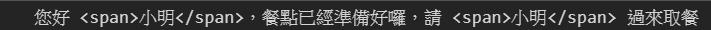
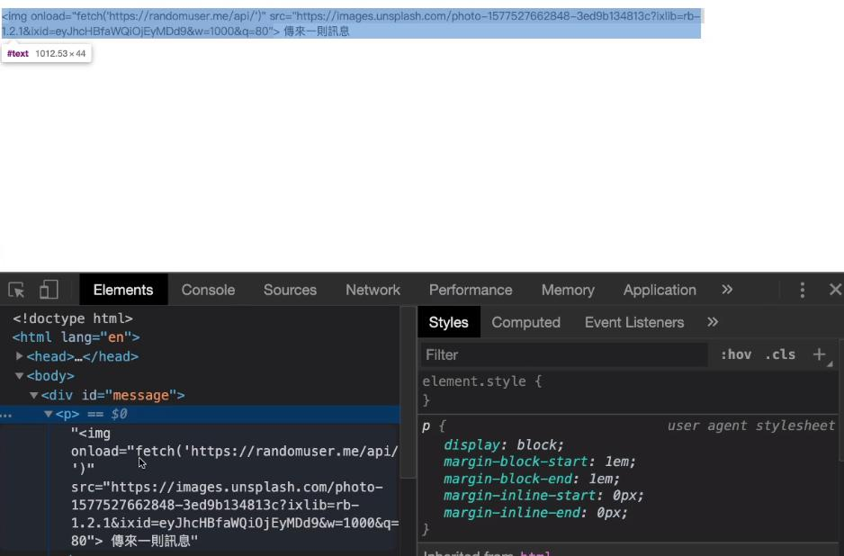

# 標籤樣板字面值

:::tip 說明
利用自訂函式，達到引用變數的替換
:::

## 範例一

為每一個傳入變數加上 `span` 標籤

```js
const myName = '小明';
// strings 為陣列：['您好 ', '，餐點已經準備好囉，請 ', ' 過來取餐']
// 展開的 arg 為陣列：['小明', '小明']
const highlight = (strings, ...arg) =>
  strings
    .map((str, i) => `${str}${arg[i] ? `<span>${arg[i]}</span>` : ''}`)
    .join('');
const sentence = highlight`您好 ${myName}，餐點已經準備好囉，請 ${myName} 過來取餐`;
```



## 預防 XSS 攻擊

參考
[XSS 說明](https://forum.gamer.com.tw/Co.php?bsn=60292&sn=11267)

主要使用 **DOM-Based 防範**，在畫面渲染的時候，為敏感字元做替換，結果即為文字格式，非 `HTML` 格式

- 範例一

```js
function convertHTML(strings, ...keys) {
  return strings
    .map(
      (str, i) =>
        `${str}${
          keys[i]
            ? `${keys[i]
                .replace(/&/g, '&amp;')
                .replace(/</g, '&lt;')
                .replace(/>/g, '&gt;')}`
            : ''
        }`
    )
    .join('');
}
// 如果正常呈現(非用作 XSS 預防)，則在載入圖片時，同時執行 ajax
// 有機會將用戶資訊洩漏出去
const messageName = ``;
document.querySelector(
  '#message'
).innerHTML = convertHTML`<p>${messageName}</p>`;
```



- 範例二

```js
const unescapeHTML = (str) =>
  str.replace(
    /&|<|>|'|"/g,
    (tag) =>
      ({
        '&': '&amp;',
        '<': '&lt;',
        '>': '&gt;',
        "'": '&#39;',
        '"': '&quot;',
      }[tag] || tag)
  );
unescapeHTML('<a href="#">Me & you</a>');

// 輸出結果
// "&lt;a href=&quot;#&quot;&gt;Me &amp; you&lt;/a&gt;"
// 在網頁上渲染即為文字字串
```
