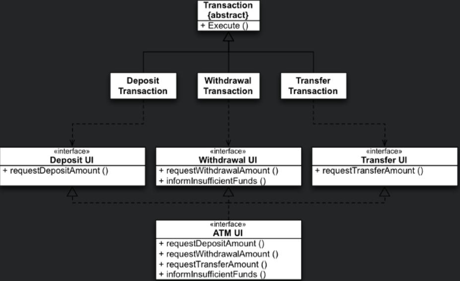

# S.O.L.I.D

## SPR - 單一職責

<BaseIframe url-id="dyMVXej"></BaseIframe>

### 參考

[單一職責原則 Single Responsibility Principle (SRP)](https://medium.com/@f40507777/%E5%96%AE%E4%B8%80%E8%81%B7%E8%B2%AC%E5%8E%9F%E5%89%87-single-responsibility-principle-7b4eb03f1fff)

[S.O.L.I.D 五大原则之单一职责 SRP](https://www.javascriptc.com/3663.html)

## OCP - 開放封閉

Open for extension（對擴展開放）的意思是說當新需求出現的時候，可以通過擴展現有模型達到目的。

而 Close for modification（對修改關閉）的意思是說不允許對原先的實體做任何修改。

其實，就是這些需要執行多樣行為的實體，應該設計成不需要修改就可以實現各種的變化，堅持開閉原則有利於用最少的代碼進行項目維護。

<BaseIframe url-id="poyWRPj"></BaseIframe>

### 參考

[開放封閉原則 Open-Closed Principle (OCP)](https://medium.com/@f40507777/%E9%96%8B%E6%94%BE%E5%B0%81%E9%96%89%E5%8E%9F%E5%89%87-open-closed-principle-31d61f9d37a5)

[S.O.L.I.D 五大原则之开闭原则 OCP](https://www.javascriptc.com/3664.html)

## LSP - 里氏替換原則

繼承的特性導致高耦合，子類別對於方法修改(Override, Overload) 必須依照父類別行為方向，否則會對整體的繼承體系照成破壞，會有產生 **不可預測的行為** 與 **不好察覺 Bug**。

如果遵循後可以減少 Reuse 上的 Bug 並且擴展子類別以達到新增功能，對於 **開放封閉原則(Open-Closed Principle)** 來說可以安全的新增子類別。

<BaseIframe url-id="vYGdVzE"></BaseIframe>

在這個範例中，很明顯地違反 LSP，因為 Square 的等邊長 **行為** 所以需要 override，違反了 Rectangle 不變性，導致 Square 不能替換成 Rectangle。

### 繼承的目的？

1. Reuse Code：可以使用組合，將共同部分抽取出來，來代替繼承，若非得要繼承，就不能 override
1. 為了多型：可以用抽象類別，避免父類別實作

### 參考

[里氏替換原則 Liskov Substitution Principle (LSP)](https://medium.com/@f40507777/%E9%87%8C%E6%B0%8F%E6%9B%BF%E6%8F%9B%E5%8E%9F%E5%89%87-liskov-substitution-principle-adc1650ada53)

[S.O.L.I.D 五大原则之里氏替换原则 LSP](https://www.javascriptc.com/3665.html)

## ISP - 介面隔離原則

### 沒有遵守的話會？

1. 繼承或抽象類別：多餘的介面在子類別可能會有 **空實作** 會對使用方照成 **不可預期的錯誤**

1. Compile：**未使用方法的變更** 而帶來的變更，假設 A 類別有 BCD 方法，E 用了 B 其他人用了 C 或 D，假設為了 E 改變了 B 介面，這樣導致 C 跟 D 的使用者全部要重新 Compile

### 解決方法

- 客製化介面：客制用戶的 Interface，只提供用到的，再利用 **組合實作**
- 分割組合：將類別分割後，需要 reuse 實作地方在利用 **組合方式** 實現，這裡可以使用多重繼承或 Delegate 等等

---

將介面操作拆分，利用多重繼承或協定繼承可以將 Screen UI 合併起來。

<BaseIframe url-id="wvGyOPm"></BaseIframe>

### 參考

[介面隔離原則 Interface Segregation Principle (ISP)](https://medium.com/@f40507777/%E4%BB%8B%E9%9D%A2%E9%9A%94%E9%9B%A2%E5%8E%9F%E5%89%87-interface-segregation-principle-isp-6854c5b3b42c)
