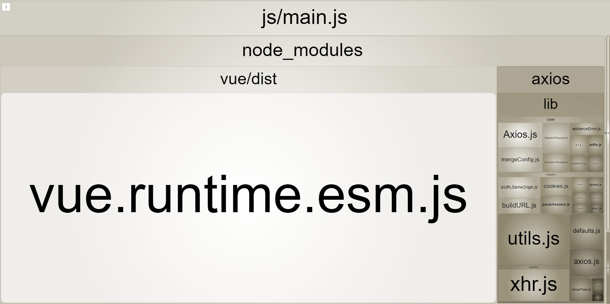
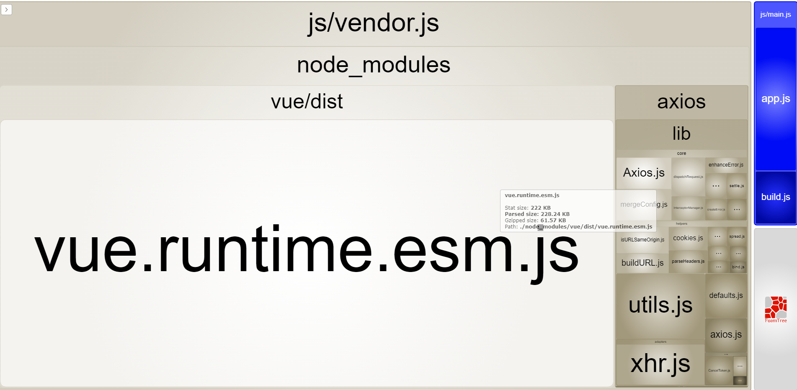
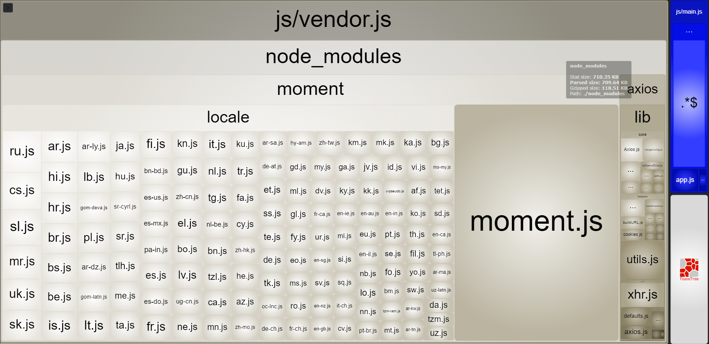
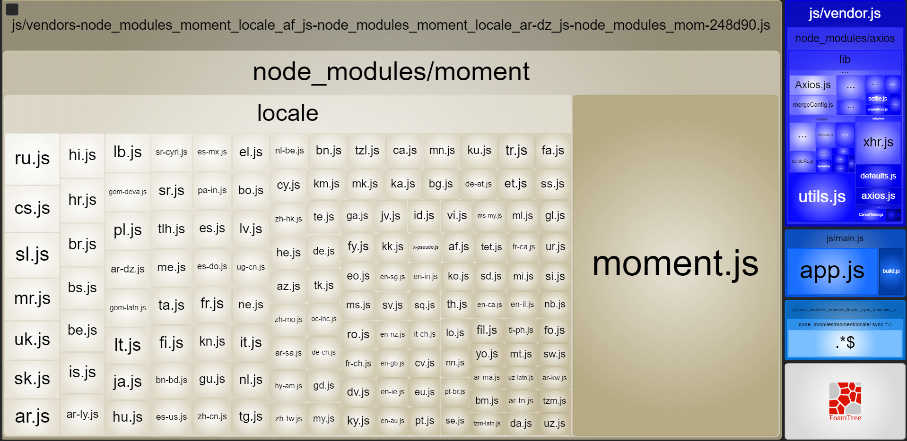

# Optimization

## Code Splitting

Webpack 提供的 code splitting 功能，可以將單一檔案拆分成許多小塊 (chunk)。

這些 chunk 可以平行被載入，或是有需要時才動態載入，也可以各自被快取，因此可以加快瀏覽器的下載速度。

## 拆分 vendor bundle

參考 [拆分 vendor bundle](https://shubo.io/optimize-loading-speed/#%E6%8B%86%E5%88%86-vendor-bundle) 將打包出來的 JavaScript bundle 分成三個部分：

- Application bundle：產品的 UI 跟商業邏輯等
- Vendor bundle：產品依賴的第三方套件，例如 Vue.js 或是各種 npm 上的套件
- Webpack runtime and manifest：負責所有模組之間的互動，一般來說體積很小可以忽略不計

運用 code splitting 的技巧，將第三方套件額外拆分成額外的 bundle，就是 vendor bundle。

拆出 vendor bundle 的好處是：**容易被快取**，因為第三方套件不太會頻繁更動，如果使用者不是第一次造訪我們網站，瀏覽器快取很有可能已經下載過 vendor bundle，只要下載包含業務邏輯變化的 application bundle 就好。

## 運用 webpack-bundle-analyzer 做分析

使用 [webpack-bundle-analyzer](https://github.com/webpack-contrib/webpack-bundle-analyzer) 將 bundle 內容按照檔案的大小排列，做視覺化的呈現。

假設專案的主要 Entry 為 `app.js`：

```js
import Vue from 'vue';
import axios from 'axios';
import { sayHi } from './build';

new Vue({
  el: '#app',
});

console.log(sayHi('Alex'));
```

優化前的 bundle 內容：



可以注意到 application bundle 包含很大一塊 node_modules，也就是第三方套件。

因為 vendor bundle 並不常變動，所以 **將所有第三方套件都完整包進 vendor bundle 會讓快取更有效率、效能更好**。

修改 `webpack.config.js` 如下：

```js
module.exports = {
  optimization: {
    splitChunks: {
      cacheGroups: {
        vendor: {
          test: /node_modules/,
          name: 'vendor',
          chunks: 'initial',
          enforce: true,
        },
      },
    },
  },
};
```

雖然 bundle 出來的總檔案大小相同，但 **有效地將 application 和 vendor bundle 切分，使 application bundle 的大小減少，讓有快取的情況下使用者進站的速度變快**。



## 對肥大的第三方套件做 dynamic imports

仔細觀察 vendor bundle 內容，可能會注意到某些第三方套件佔據很大的體積，因此要讓它們 **只在需要的時候載入**。

這邊載入 `moment.js` 套件，原始的大小約為 `71.6KB`，在未按照需求載入的情況，會如下方：



經過調整後：

```js
// app.js
import('moment').then(({ default: moment }) => {
  const p = document.querySelector('p');
  p.textContent = moment().format();
});
```

並手動將大型第三方套件從 vendor bundle 中排除：

```js
// webpack.config.js
module.exports = {
  optimization: {
    splitChunks: {
      cacheGroups: {
        vendor: {
          test: /[\\/]node_modules[\\/](?!moment)/,
          name: 'vendor',
          chunks: 'initial',
          enforce: true,
        },
      },
    },
  },
};
```



`vendor.js` 從原來的 `804.85KB` 變為 `60.87KB`，並可以從 Dev Tool 的 Network 中看到，在使用對應的功能時，才會將 JavaScript 檔案引入。

## 參考

[前端工程師都該懂的 6 個網頁載入加速技巧 (加速 30% 真實案例分享)](https://shubo.io/optimize-loading-speed/)
